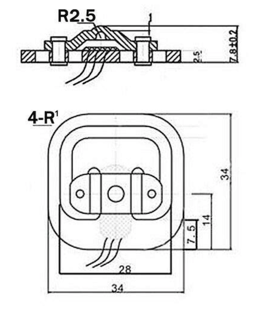

# G29 Load Cell Mod

WIP on replacing the stock brake pedal sensor on a Logitech G29 pedal set with a load cell

It uses two cheap load cells arranged in a [wheatstone bridge](https://en.wikipedia.org/wiki/Wheatstone_bridge)
and a small circuit using a Instrumentation Op-Amp in reverse gain mode.  The cells are mounted in a 3D printed
model that replaces the lower half of the brake piston assembly

# Software used

1. EAGLE https://www.autodesk.co.uk/products/eagle/free-download
2. Fusion 360 https://www.autodesk.com/campaigns/fusion-360-for-hobbyists

# G29 brake levels

From reading around it seems that there is not an agreed set of values for what represents
min and max braking.  Below is a table I took from attaching an AVO directly to the middle pin 
of the brake potentiometer on my set and monitoring the output on the PS4:

| Level | Voltage |
|------:|---------|
| 0%    | 3.0     |
| 25%   | 2.5     |
| 50%   | 2.2     |
| 75%   | 2.0     |
| 100%  | 1.9     |

# Pedal Pin Outs

    -----------------------
    \  1   2   3   4   5  /
     \   6   7   8   9   /
       -----------------

| Pin | Role
| --- | ---------
| 1   | Gnd
| 2   | Throttle
| 3   | Brake
| 4   | Clutch
| 5   | NC
| 6   | +3.3v
| 7   | NC
| 8   | NC
| 9   | +3.3v

The above values were taken by removing the wiring loom from the pedal set
and measuring at the spade connectors.
Note that these pin outs are different to those reported by others for the G27
with +3.3v and Gnd switched

# Load Cells

The load cells are cheap bathroom scale variety.  I got mine from amazon:

https://www.amazon.co.uk/gp/product/B07TWLP3X8

Each cell is comprised of two resistors one which increases under load and the 
other which decreases.  Zero load is approx 1k, with about 2-3 Ohm change under heavy load

# INA122P

Since we need to output a higher voltage with no load on the cells and we have 
them arranged in an 'almost' balanced wheatstone bridge with no load, 
we have two choices:

1. unblance the bridge so that load brings it back into balance
2. invert the gain

Unblancing the bridge would involve tweaking one side of the bridge by a very small
resistance, so I decided to just invert the gain instead.  Fortunately, the INA122 is
rail to rail, so you can have `Vout` go all the way to `V+` by tying `ref` to `V+`.

For our purposes, we actually want zero load to be a little less then `V+`, so we 
use another trimpot to bring `ref` down to reduce the upper deadzone.  
Unfortunately, this causes the common mode rejection to degrade as we have a high 
impedence on `ref`.  As per the datasheet, we should really put a unity gain op-amp
in place to act as a buffer, but since we do not require high precision, we can 
simply reduce `ref` lower as required and not worry too much about it's precise value

# STL models

There are two separate bodies.  [stl/holder.stl](stl/holder.stl) contains the model for the load cell holder
that mounts into the pedal frame and [stl/spacer.stl](stl/spacer.stl) contains the model for the small 
spacer that sits between the two cells