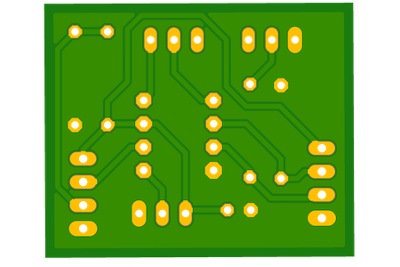

# G29 Load Cell Mod

Modification to replace the stock brake pedal sensor on a Logitech G29 pedal set with a load cell,
the purpose of which is to more closely simulate a real brake system which is dependent on
the force applied to the pedal and not the pedal position

I assume this would work on the G920 without any issues, and possibly the G27 and G25,
however I have not had the opportunity to test.

It uses a cheap load cell with two closely matched 1k resistors arranged in a
[Wheatstone bridge](https://en.wikipedia.org/wiki/Wheatstone_bridge)
and an Instrumentation Op-Amp.  The cell is mounted in a 3D printed
model that replaces the lower half of the brake piston assembly

There is a digital version by [SkiDude88](https://github.com/Skidude88/Skidude88-G29-PS4-LoadCell-Arduino/wiki) 
using an HX711, that often comes bundled with the load cells, and an Arduino

Assembly re-uses the spring and rubber block, along with a short piece of M10 rod.
The adjustment of the location of the washer and the protrusion of the top nut
allow changes to the first stage of the pedal, which is designed to simulate
the initial feel of the pedal as the pads move into contact with the disc.

Fully installed, with the amplifier circuit mounted in a small case

# Shopping list

1. 3D printer capable of 80mm x 43mm x 43mm
2. Bathroom scale type loadcells
3. PCB copper board or stripboard (35mm x 30mm)
4. INA122P instrumentation amplifier
5. 1k trim pot
6. 10ohm trim pot 
7. 2x 1k resistor
8. 100ohm resistor (fake clutch)
9. 900ohm resistor (fake clutch)
10. M10 thread ~30mm
11. 3x Half height M10 nuts
12. 1x M10 nut
13. M10 to 24mm washer

# Software used

1. EAGLE https://www.autodesk.co.uk/products/eagle/free-download
2. Fusion 360 https://www.autodesk.com/campaigns/fusion-360-for-hobbyists

# Load Cells

The load cells are cheap bathroom scale variety.  I got mine from Amazon:

https://www.amazon.co.uk/gp/product/B07TWLP3X8

Each cell is comprised of two resistors one which increases under load (white) and the 
other which decreases (black).  Zero load is approx 1k, with about 2-3 Ohm change under heavy load

# Amplifier Circuit

The loadcell is connected to the circuit as follows:

1. Red -> 3.3v
2. Black -> V+
3. White -> V-

Since we need to output a higher voltage with no load on the cells 
we have to unbalance the bridge so that load brings it back into balance.

The 1k resistors for `R1` and `R2` should be measured and the larger of the two should
be used for `R1` to allow `R_BAL1` to adjust the link with `R2` and force the bridge out of 
balance with no load

`R_REF` should be replaced with a link from the middle pin to the right pin.  This
will tie the `REF` pin on the INA122P to ground.
It was originally used when the design had two load cells
and the INA122P was inverting the gain.

Astute observers may have noticed the connections for the loadcell appear to be
reversed in reference to V+ and V-.  This is because the labelling on the PCB of 
V+ and V- was in reference to the dual load cell configuration and hence the 
labels on the PCB are not correct for a single cell.

## Clutch

The circuit also allows for simulating a clutch, allowing it to be removed if desired.
The G29 has been known to glitch if the clutch is disconnected and the leads left hanging.

If you do not need this feature, you can leave `R3` and `R4` unpopulated on the board

# PCB

The PCB design is a little tricky to manually etch, so we came up with a slightly
larger design to help.  Note that this is a mirror image to print and apply to
the copper via toner transfer.  You can find a pdf with the correct size [here](pcb/load_cell_amp_diy.pdf)

# STL model

Previous prints have been done with the model on it's side.  This was to ensure the grain
in the upper cylinder was along the length of the cylinder

[stl/single_holder.stl](stl/single_holder.stl) 

# G29 brake levels

From reading around it seems that there is not an agreed set of values for what represents
min and max braking.  Below is a table I took from attaching an AVO directly to the middle pin 
of the brake potentiometer on my set and monitoring the output on the PS4:

| Level | Voltage |
|------:|---------|
| 0%    | 3.0     |
| 25%   | 2.5     |
| 50%   | 2.2     |
| 75%   | 2.0     |
| 100%  | 1.9     |

# Pedal Pin Outs

    -----------------------
    \  1   2   3   4   5  /
     \   6   7   8   9   /
       -----------------

| Pin | Role      | Colour
| --- | --------- | ------
| 1   | Gnd       | Black
| 2   | Throttle  | Orange
| 3   | Brake     | White
| 4   | Clutch    | Green
| 5   | NC        |
| 6   | +3.3v     | Red
| 7   | NC        |
| 8   | NC        |
| 9   | +3.3v     | Red

The above values were taken by removing the wiring loom from the pedal set
and measuring at the spade connectors.
Note that these pin outs are different to those reported by others for the G27
with +3.3v and Gnd switched

# Inspiration

This is a popular mod and others have come before with interesting designs that you may also
want to take a look at:

- https://www.reddit.com/r/simracing/comments/92exmk/diy_load_cell_brake_for_g29_with_native_ps4/
- https://www.racedepartment.com/threads/low-budget-load-cell-mod-for-logitech-g25-g27-g29.167760/
- https://imgur.com/gallery/gOjAf#SXX5zrY
- https://www.racedepartment.com/threads/logitech-g25-g27-g29-g920-load-cell-diy-project.174623/
